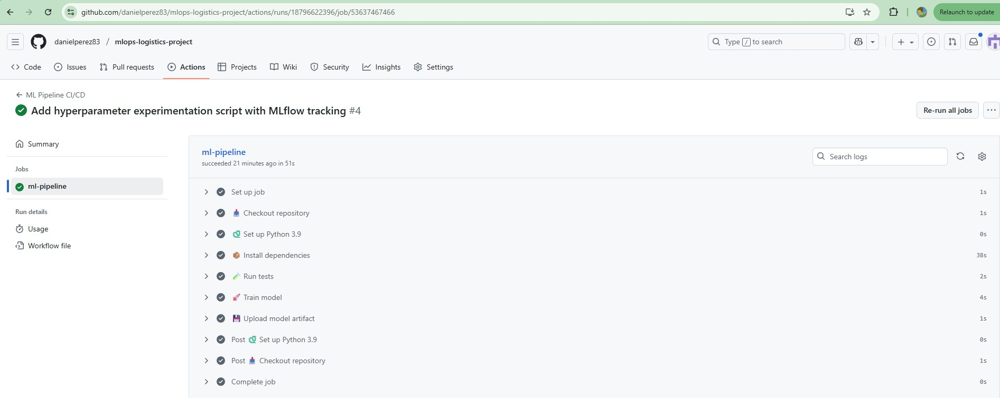
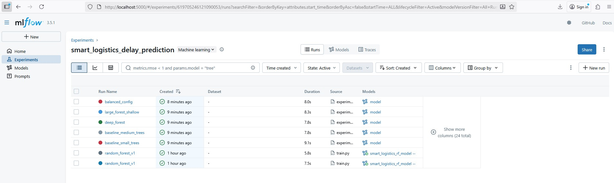
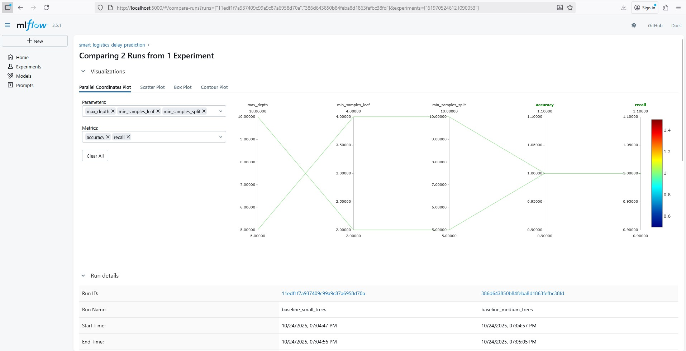
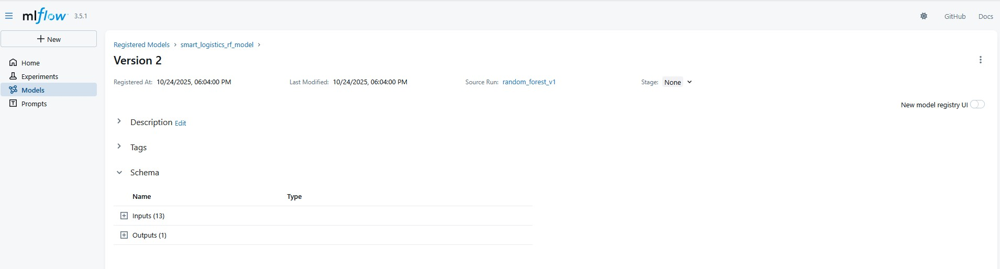

## 👥 Autores

- **Laura Carolina Mateus Agudelo**
- **Andrés Felipe Sainea Rojas**
- **Daniel Antonio Pérez Beltrán**

- Universidad EAN
- Maestria en Ciencia de Datos
- Proyecto Final - MLOps

# 🚀 Smart Logistics Delay Prediction - MLOps Project

Proyecto de automatización de pipeline de Machine Learning con GitHub Actions y MLflow para predicción de retrasos en logística.

## 📊 Descripción del Proyecto

Sistema automatizado de ML que predice retrasos en entregas logísticas basado en múltiples factores como:
- Condiciones climáticas (temperatura, humedad)
- Estado del tráfico
- Características del envío (peso, distancia)
- Uso de activos y demanda

**Objetivo**: Implementar un pipeline reproducible de ML completamente automatizado con prácticas de MLOps.

## 📁 Estructura del Proyecto
```
mlops-logistics-project/
├── .github/
│   └── workflows/
│       └── ml.yml              # GitHub Actions CI/CD
├── src/
│   ├── __init__.py
│   ├── data_loader.py          # Carga y validación de datos
│   ├── preprocessing.py        # Preprocesamiento de datos
│   └── train.py                # Entrenamiento y MLflow tracking
├── tests/
│   └── test_basic.py           # Tests unitarios
├── data/
│   └── smart_logistics_dataset.csv
├── config.yaml                 # Configuración e hiperparámetros
├── requirements.txt            # Dependencias
├── Makefile                    # Automatización de tareas
└── README.md
```

## 🔧 Instalación

### Requisitos Previos
- **Python 3.9 - 3.12** (recomendado: 3.9 o 3.10)
- pip >= 21.0
- Git

### Pasos de Instalación

1. **Clonar el repositorio**
```bash
git clone https://github.com/danielperez83/mlops-logistics-project.git
cd mlops-logistics-project
```

2. **Crear entorno virtual**
```bash
python3 -m venv .venv
source .venv/bin/activate  # En Windows: .venv\Scripts\activate
```

3. **Actualizar pip y setuptools**
```bash
pip install --upgrade pip setuptools
```

4. **Instalar dependencias**
```bash
pip install -r requirements.txt
# O usando make
make install
```

### Troubleshooting

**Si usas Python 3.12 y ves warnings de `pkg_resources`:**
```bash
pip install --upgrade setuptools mlflow
```

**Si MLflow UI falla:**
```bash
# Opción 1: Actualizar MLflow
pip install --upgrade mlflow

# Opción 2: Usar Python directamente
python -m mlflow ui
```

## 🚀 Uso

### Entrenar el Modelo
```bash
make train
```

### Ejecutar Tests
```bash
make test
```

### Verificar Código (Linting)
```bash
make lint
```

### Ejecutar Pipeline Completo
```bash
make all
```

### Ver Resultados en MLflow
```bash
mlflow ui
```
Luego abrir: `http://localhost:5000`

## 📊 Dataset

**Fuente**: Smart Logistics Supply Chain Dataset (Kaggle)

**Características**:
- 1,000 registros de entregas
- 16 columnas (13 features + 3 auxiliares)
- Variable objetivo: `Logistics_Delay` (binaria: 0=No, 1=Sí)

**Features principales**:
- **Numéricas**: Latitude, Longitude, Temperature, Humidity, Inventory_Level, etc.
- **Categóricas**: Asset_ID, Shipment_Status, Traffic_Status

**Distribución de clases**:
- Clase 0 (Sin retraso): 43.4%
- Clase 1 (Con retraso): 56.6%

## 🤖 Modelo

**Algoritmo**: Random Forest Classifier

**Hiperparámetros**:
```yaml
n_estimators: 100
max_depth: 10
min_samples_split: 5
min_samples_leaf: 2
class_weight: balanced
```

## 📈 Resultados

### Métricas de Evaluación
- **Accuracy**: 1.0000
- **Precision**: 1.0000
- **Recall**: 1.0000
- **F1-Score**: 1.0000
- **ROC-AUC**: 1.0000

> **Nota**: Las métricas perfectas se deben al tamaño pequeño del dataset de ejemplo. En producción, se esperarían métricas más realistas.

### Matriz de Confusión
```
[[ 87   0]
 [  0 113]]
```

## 🔄 CI/CD con GitHub Actions

El proyecto incluye automatización completa con GitHub Actions que:

1. ✅ Se ejecuta automáticamente en cada push a `main`
2. ✅ Instala dependencias
3. ✅ Ejecuta tests
4. ✅ Entrena el modelo
5. ✅ Guarda el modelo como artefacto (disponible por 30 días)

**Ver workflow**: `.github/workflows/ml.yml`

### Evidencias de Ejecución

**Pipeline Completo Ejecutado:**



**Artefactos Generados:**


El workflow genera artefactos descargables que incluyen:
- Modelo entrenado (mlruns/)
- Feature importance (CSV)
- Logs de ejecución

## 📝 MLflow Tracking

El proyecto utiliza MLflow para:
- **Parámetros**: Hiperparámetros del modelo y configuración
- **Métricas**: Accuracy, F1, Precision, Recall, ROC-AUC
- **Modelo**: Guardado con signature e input_example
- **Artifacts**: Feature importance, confusion matrix

### Evidencia de MLflow

**Experiment Name**: `smart_logistics_delay_prediction`

**Modelo Registrado**: `smart_logistics_rf_model`

**Vista de Experimentos:**



Todos los experimentos quedan registrados con sus parámetros y métricas, permitiendo comparación y reproducibilidad.

**Comparación de Modelos:**



MLflow permite comparar múltiples configuraciones de hiperparámetros lado a lado, visualizando cómo cada parámetro afecta las métricas.

**Modelo Registrado con Signature:**



El modelo incluye:
- ✅ **Signature**: Schema de entrada (13 features) y salida
- ✅ **Input Example**: Ejemplos de datos de entrada
- ✅ **Metadata completa**: Timestamp, source run, versión

Esto garantiza que el modelo es deployable y tiene un contrato claro de entrada/salida.
```

El modelo incluye:
- ✅ Signature (definición de input/output)
- ✅ Input Example (ejemplos de datos de entrada)
- ✅ Todos los parámetros e hiperparámetros
- ✅ Todas las métricas de evaluación
- ✅ Feature importance

## 🧪 Tests

El proyecto incluye 8 tests unitarios que verifican:
- ✅ Existencia de archivos de configuración
- ✅ Carga correcta del dataset
- ✅ Validación de datos
- ✅ Pipeline de preprocesamiento
- ✅ División train/test

**Ejecutar tests**:
```bash
make test
```

## 📦 Dependencias Principales
```
pandas==2.1.4
numpy==1.26.3
scikit-learn==1.4.0
mlflow==2.9.2
pyyaml==6.0.1
pytest==7.4.4
```

## 🛠️ Comandos del Makefile

| Comando | Descripción |
|---------|-------------|
| `make help` | Mostrar ayuda |
| `make install` | Instalar dependencias |
| `make train` | Entrenar modelo |
| `make test` | Ejecutar tests |
| `make lint` | Verificar código |
| `make clean` | Limpiar archivos generados |
| `make all` | Ejecutar pipeline completo |

## 📚 Documentación Adicional

- **MLflow**: https://mlflow.org/docs/latest/index.html
- **scikit-learn**: https://scikit-learn.org/
- **GitHub Actions**: https://docs.github.com/en/actions

